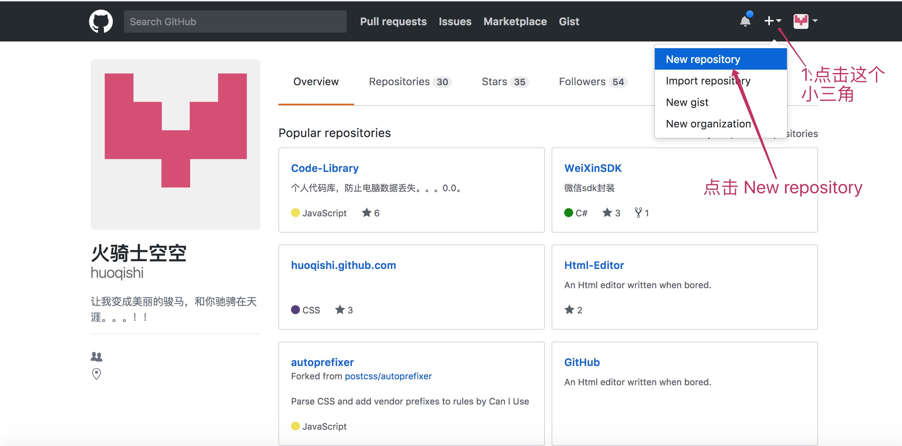
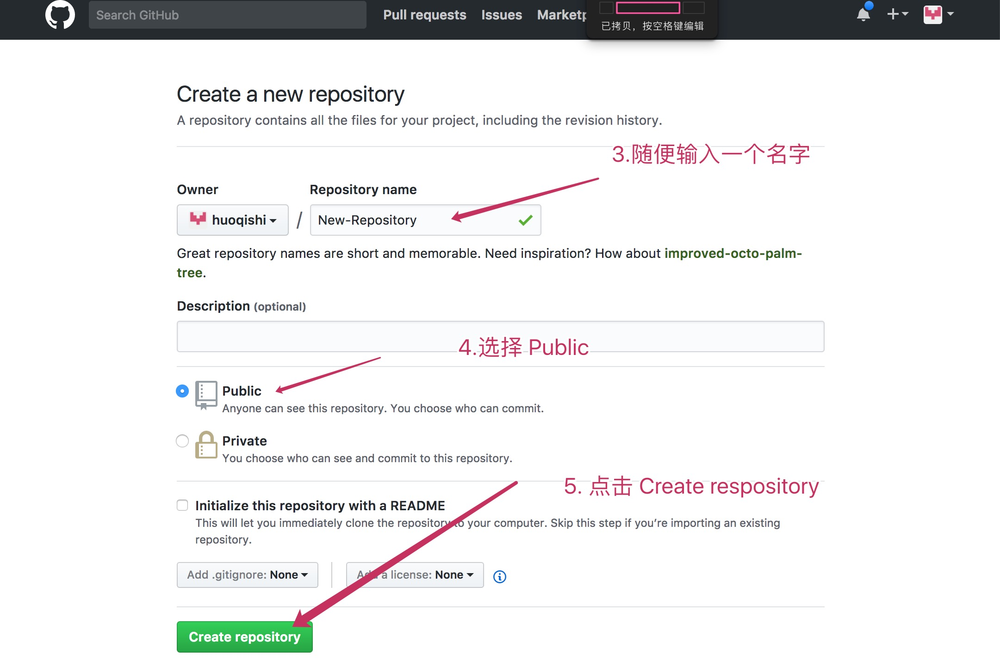
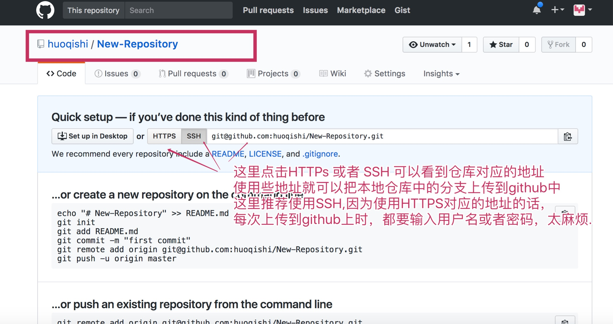
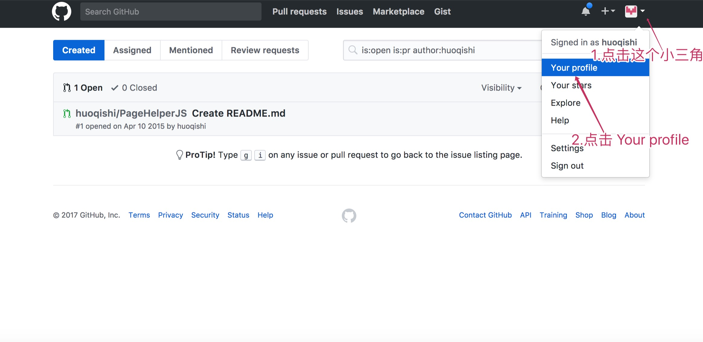
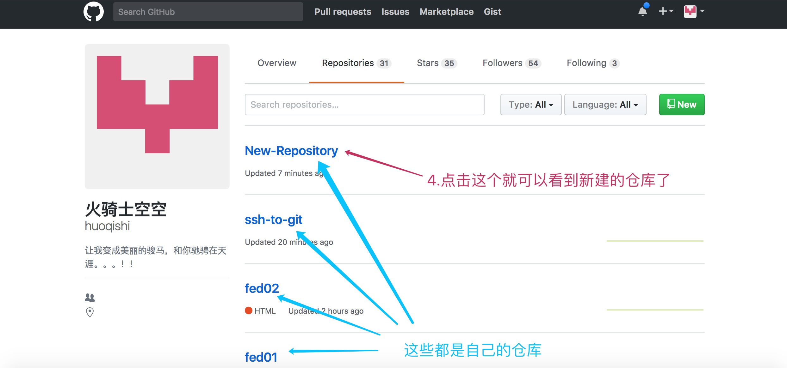
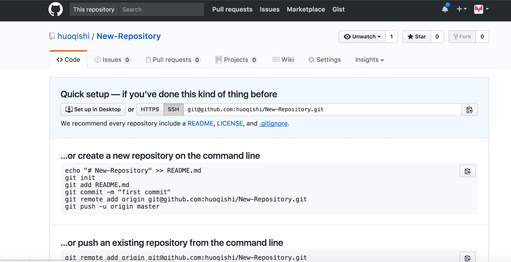
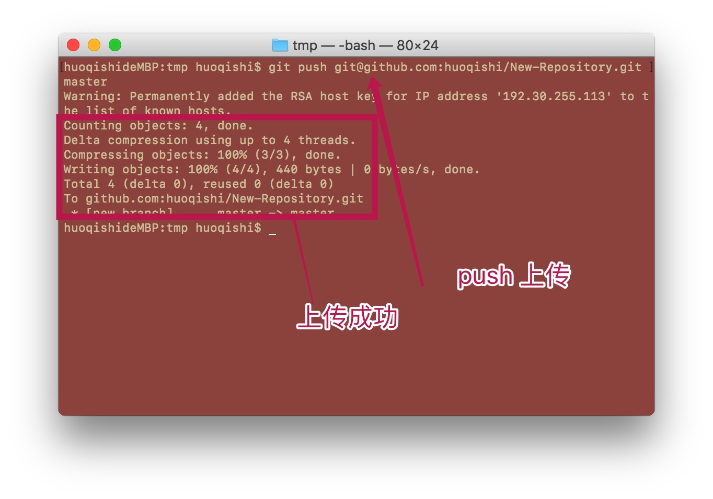
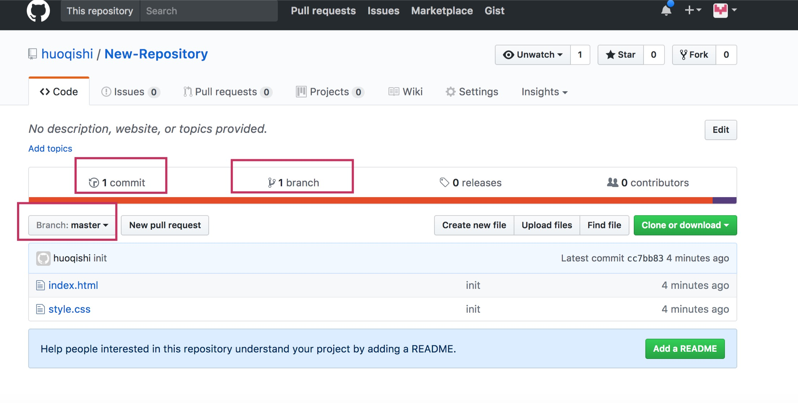

# 将本地仓储里的代码上传(push)到无端仓库(github)
1. 首先要有个本地仓库,并在本地随便提交几次 

2. 新建一个远端仓库  

继续

创建完成: 

这个界面就是对应的远端仓库的界面,现在还没有上传东西，所以看不到上传的文件。

> 如果不小心关闭了这个界面的话,也是可以再次找到的! 

3. 在项目中打开 git bash
可以使用命令`git push 远端地址 本地分支:远端分支`来将本地分支上传到远端:  
示例:   
`git push git@github.com:huoqishi/New-Repository.git master:master`
这里两个master可以只写一个 `master`  

此时,刷新一下，自己的远端仓库对应的网页  

*注意*
为了避免冲突，可以先pull 然后再push 